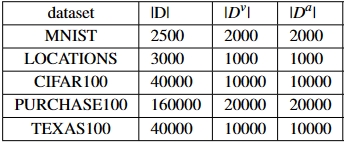

# Data Points Attraction Manipulation(DPAM) against Membership Inference Attack
## Experimental environment
The primary environment is Python 3.7 and you need to install pytorch==1.6.0, sklearn==1.0.2, opacus (for differential privacy, comment out the import of this library if you do not use differential privacy).
## Dataset
In this experiment, we used six data sets of MNIST, CIFAR10, CIFAR100, TEXAS, LOCATIONS, and PURCHASE for the experiment. Among them, MNIST contains 10 classifications, LOCATIONS contains 30 classifications, and TEXAS, PURCHASE and CIFAR100 contain 100 classifications. In our experiment, all datasets are divided into three parts, D, Dv, and Da. D and Dv are the training set and test set of the target model. In our hypothesis, the attacker can obtain part of training Sets D, half of D and Da are used as member and non-member data to train the attack model. Finally, we use D and Dv to evaluate the attack model. The number of training data as well as reference data samples which we used in our experiments for different datasets：
</br>

## Run
### Train shadow model
We first need to train a shadow model that simulates the behavior and output of the target model.
```
python train_shadow.py --dataset CIFAR100 --epochs 100
```
### Train target model
Then we need to train the target model, which plays the role of victim in our experiment, and its dataset is divided according to the table above.
```
python train_target.py --dataset CIFAR100 --epochs 100 --defense None --train_size 40000 --valid_size 10000 --attack_size 10000
```
### Implement inference
After completing the above two steps, you can use a dichotomous model to perform inference. You can experiment with any model in sklearn.
```
python attack.apy --dataset CIFAR100 --defense None
```
